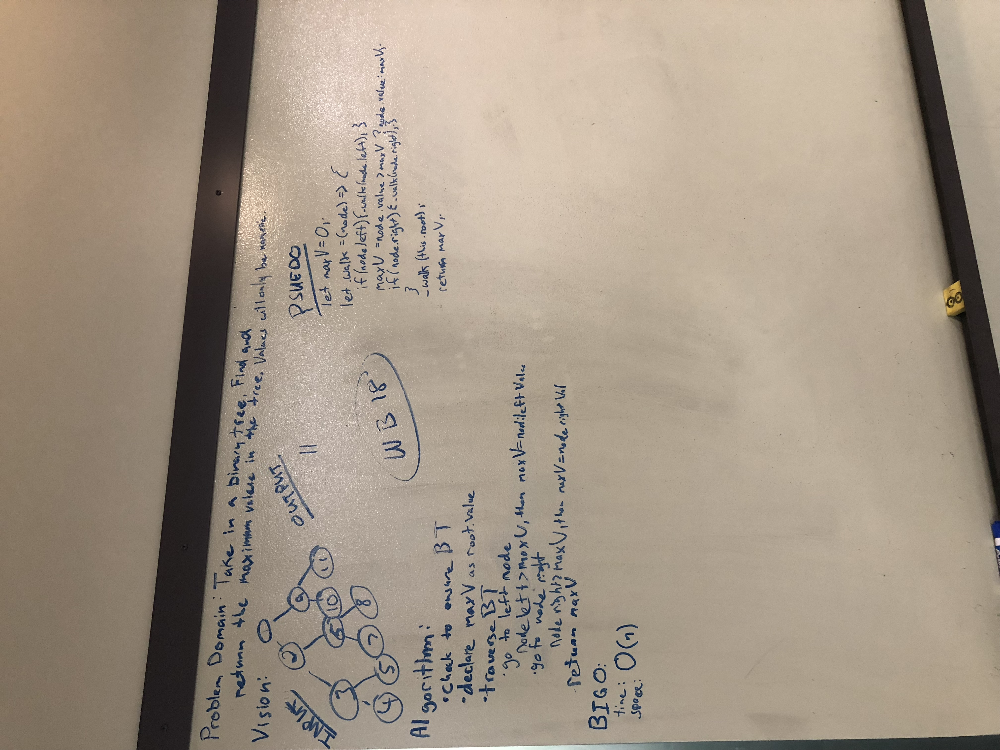

[]

# find maximum value binary tree
The goal of this WB is to take in a binary tree and return the maximum value stored in the tree. The values stored in the Binary Tree will be numeric. 

## Challenge
Take in a binary tree and return the maximum value stored in the tree. The values stored in the Binary Tree will be numeric.

## Solution
